# Lab 1: Building Your First Analytics Dossier in MicroStrategy Workstation

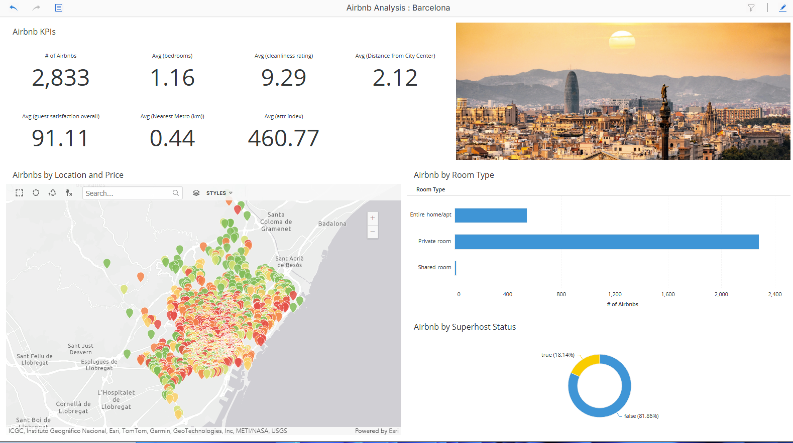

## 1. Introduction to the MicroStrategy Ecosystem and Lab Objectives

In the modern enterprise, the bridge between raw data and strategic decision-making is the "Dossier"—MicroStrategy’s premier vehicle for interactive data storytelling. MicroStrategy Workstation provides a robust, self-service environment where architects and analysts can transform disparate data into a unified visual narrative. In this lab, we will move beyond the constraints of static spreadsheets to build a multi-layered analytical tool using Airbnb data from Barcelona.

By utilizing this specific dataset, we will evaluate market dynamics through several key lenses:

- **Spatial Insights:** Using **Latitude** and **Longitude** to visualize listing density and identify the "proximity premium" of central Barcelona.
- **Financial Trends:** Analyzing **Price** clusters to identify high-value real estate pockets.
- **Behavioral Metrics:** Leveraging the **Attractiveness Index** (proximity to restaurants and attractions), **Cleanliness Rating**, and **Guest Satisfaction** scores.
- **Market Segmentation:** Categorizing the inventory by **Room Type** and **Superhost Status**.

Through these data points, you will see how a business user can transition from viewing isolated numbers to understanding complex spatial patterns and guest preferences. Our journey begins with setting up our local architecture.

## 2. Software Acquisition and Environmental Setup

MicroStrategy Workstation is designed as a standalone desktop application, offering high accessibility for users who require powerful analytics without immediate access to an enterprise server. Its "Offline Mode" is particularly valuable, allowing for local development and storage of your analytical assets.

> [!Note]
>
> You will most likely be getting access to MicroStrategy via the web interface. From there, you can author and created Dashboarsd and Reports. You will not need to install any additional software.
>
> 

### Downloading the Tool (Optional)

To acquire the software, navigate to [strategysoftware.com/strategyone/dashboards](https://www.strategysoftware.com/strategyone/dashboards). You will likely need to register with a **work email address** to access the downloads. From the product category menu, select **Desktop Application**. For this lab, we are utilizing **Workstation**; however, because MicroStrategy follows a "Latest Update" philosophy, the core workflows you learn here will remain consistent across newer iterations.

## 3. Navigating the Workstation Interface

Efficiency in data storytelling is predicated on a logical UI that separates data management from visual design. The Dossier (aka Dashboard) interface is organized into four distinct functional zones:

- **Contents Panel:** This serves as your document’s navigation spine, organizing the Dossier into **Chapters** and **Pages**. This hierarchy allows you to segment your analysis logically—for example, dedicating one chapter to spatial trends and another to host performance.
- **Data Set Panel:** This is the library of your project. It houses all the attributes and metrics available for your visualizations.
- **Editor/Filter Panels:** This is the engine room of the Dossier. Here, you define the structural roles of your data (e.g., axes, color schemes, and tooltips) and apply global filters.
- **Canvas:** A true "What You See Is What You Get" (WYSIWYG) workspace. The canvas renders your visualizations in real-time, allowing for rapid iterative design.

Understanding this layout is essential as we move into the most critical phase of the process: data ingestion.

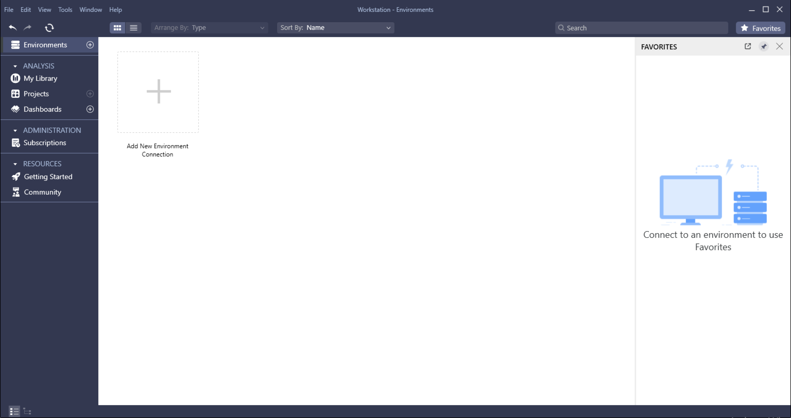

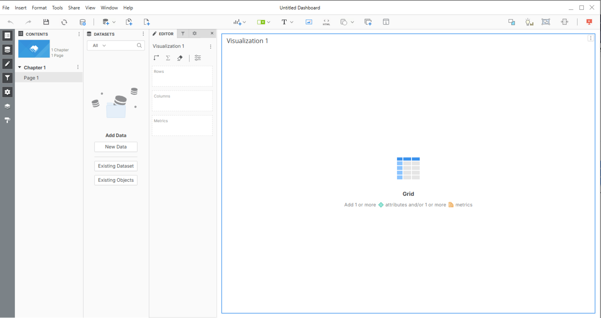

## 4. Data Ingestion and Semantic Preparation

Professional analytics relies on the quality of the underlying **Semantic Layer**. In MicroStrategy, the "Prepare Data" phase is where we define our "single version of the truth" by ensuring every data point is correctly classified before it ever hits the canvas.

### Importing the Barcelona Dataset

1. In the Data Set panel, click **New Data** and select **File from Disk**.

2. Choose your `Barcelona Airbnb Data.xlsx` file. Do **not** click Finish yet. Instead, click **Prepare Data**.

   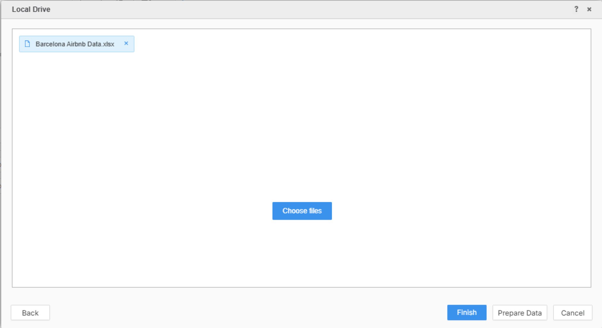

### Defining Attributes and Metrics

MicroStrategy distinguishes between descriptors (Attributes) and numerical values (Metrics). It also automatically detects geographic roles.

| Concept             | Description                                 | Airbnb Example      | Visual Icon      |
| ------------------- | ------------------------------------------- | ------------------- | ---------------- |
| **Attribute**       | Categorical descriptors; used for grouping. | Room Type, City     | Green Diamond    |
| **Geographic Role** | Attributes that enable mapping.             | Latitude, Longitude | Location Pin     |
| **Metric**          | Numerical data for calculation.             | Price, Row Count    | Blue Metric Icon |

### Manual Reclassification for Mathematical Analysis

The system may misidentify some numerical descriptors as attributes. To enable the mathematical aggregations (like averages) required for our analysis, you must manually convert several fields. Select the following (__5__) fields, right-click, and choose **Convert to Metric**:

- **Attractiveness Index** : `attr index` and `attr index norm`
- **Number of Bedrooms** : `bedrooms`
- **Cleanliness Rating** : `cleanliness rating`
- **Guest Satisfaction** :  `guest satisfaction overall`

By refining this semantic layer, we ensure our data is ready for rigorous analysis. Click **Finish** to finalize the import. Now that our data is prepared, we can visualize the spatial market trends.

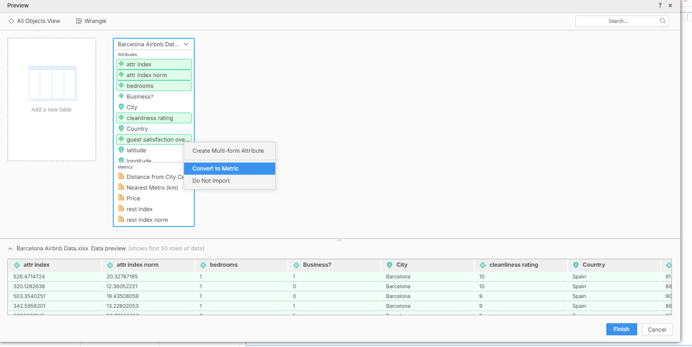

## 5. Spatial Analysis: Mapping Price and Location

Geospatial visualization allows us to see the "why" behind the numbers. In the Barcelona market, location is the primary driver of value.

1. **Initialize the Map:** Ensure you are in **Edit Mode**. Click the default Grid’s hamburger menu, select **Change Visualization**, and choose the **Esri Map**.

   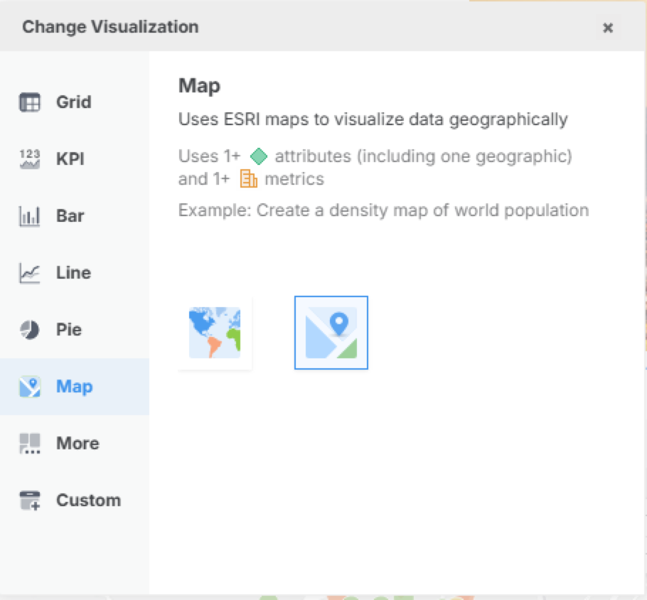

2. **Define Coordinates:** Drag the **Latitude** and **Longitude** attributes (noted by the Location Pin icon) into their respective zones in the Editor panel. The map will center on Barcelona.

3. **Visualizing Value:** Drag the **Price** metric to the **Color By** zone.

4. **Threshold Logic:** Right-click the **Price** metric in the Editor panel and select **Edit Thresholds**.

   - Choose the **Tropical Jungle** color palette.

     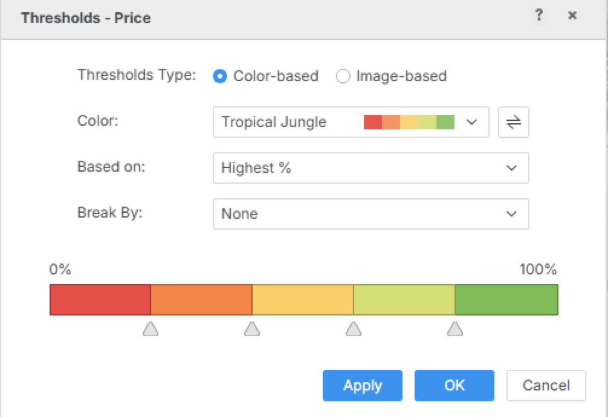

   - In the "Based on" dropdown, change the logic to **Highest %**.

   - This inverts the logic so that **Red** indicates the highest price clusters. You will immediately see that the "proximity premium"—the price hike associated with central attractions—is concentrated in the city center.

5. **Enriching the Experience:** Drag **Room Type**, **Bedrooms**, and **Guest Satisfaction** into the **Tooltips** zone. Hovering over a listing now provides a comprehensive profile of that specific property.

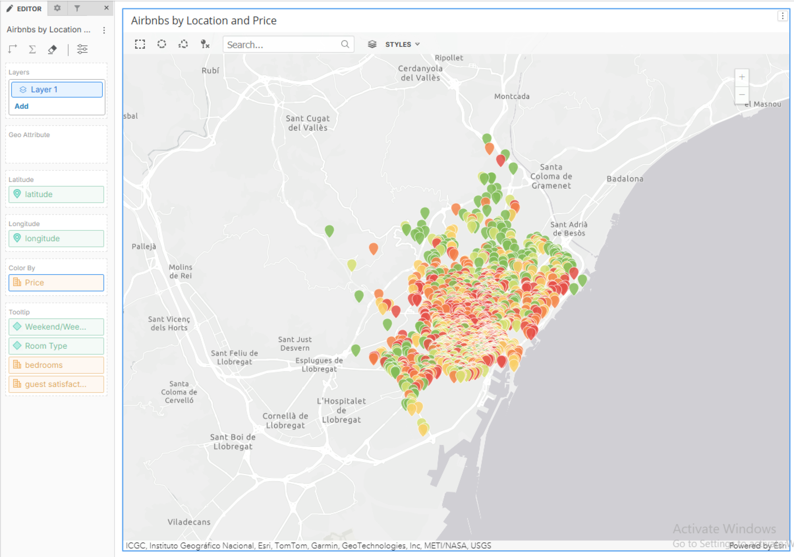

With the spatial context established, we need to examine the structural composition of the market. Name the visualization `Airbnbs by Location and Price`

## 6. Structural Analysis: Room Types and Host Status

Categorical breakdowns provide the "360-degree view" necessary to understand market supply and host quality.

### Market Composition (Bar Chart)

Add a new visualization and select the **Horizontal Bar Chart**. In the Data Set panel, right-click the system metric "Row Count" and rename it to **Number of Airbnbs**. Drag this to the horizontal axis and **Room Type** to the vertical axis. This reveals that the Barcelona market is heavily weighted toward private rooms rather than entire homes.

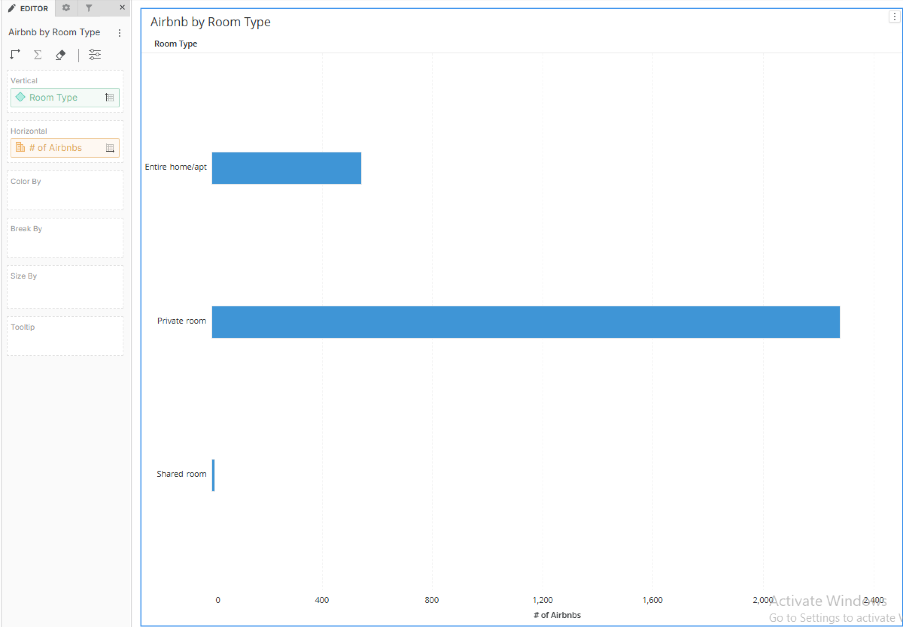

Name the visualization `Airbnb by Room Type`

### Host Quality (Ring Chart)

Add a **Ring Chart** visualization. Drag **Number of Airbnbs** to the Angle zone and **Superhost** to the Color By zone. This illustrates that only approximately 18% of hosts have achieved the elite "Superhost" status, a key indicator of high-tier service in this market.

Our dossier is taking shape, but we need high-level aggregates to provide an executive summary.

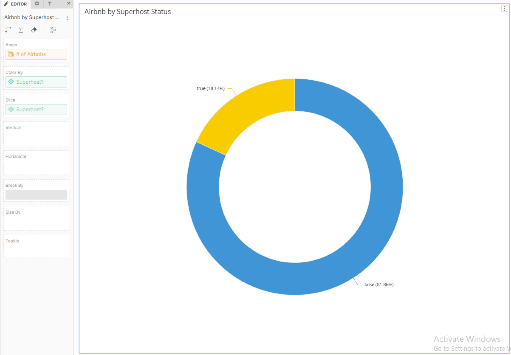

Name the visualization `Airbnb by Superhost Status`

## 7. High-Level Performance Indicators (KPIs) and Derived Metrics

Multi-metric KPIs offer a snapshot of market health. To build these, we must use **Derived Metrics**, which create new objects in our dataset panel based on specific mathematical functions.

### Optimizing the Layout

Reposition your visualizations to maximize clarity. Drag the Ring Chart beneath the Bar Chart. Position a new **Multi-Metric KPI** at the very top of the canvas, stretching it across the width to serve as a summary header.

### Creating Derived Objects

To get a true sense of the market, we need averages rather than sums.

1. Right-click **Cleanliness Rating** and select **Aggregate By > Average**. Note that a new metric object appears in your Data Set panel.

2. Repeat this for **Number of Bedrooms**, __Cleanliness Rating__, **Distance from City Center**,  **Guest Satisfaction**, __Nearest Metro (km)__

   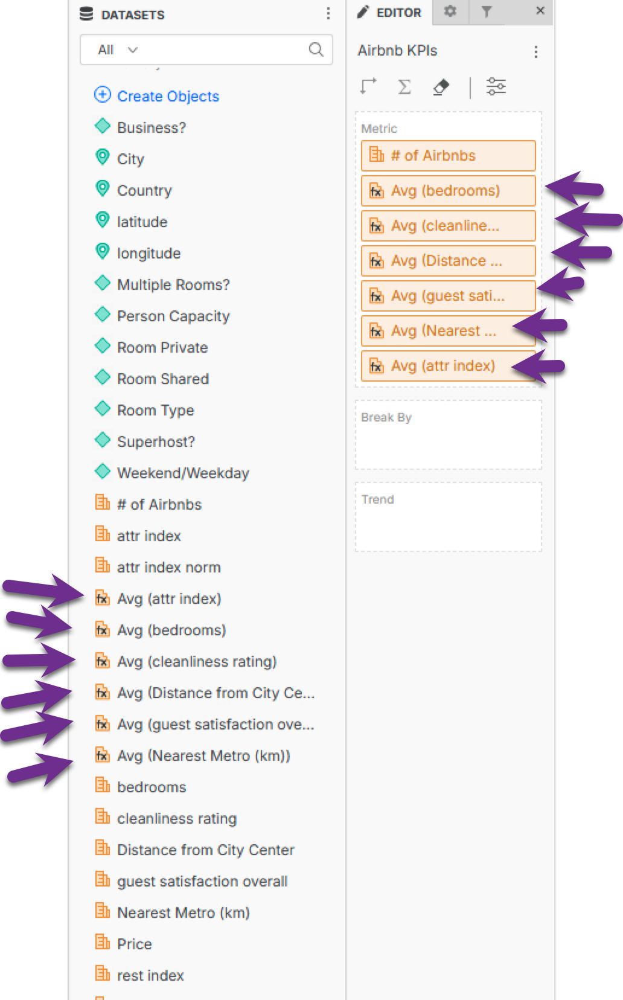

3. **Validation:** Drag these new averages into your KPI visualization. You should see city-wide benchmarks: a **91% Guest Satisfaction** score and an average **9.29 Cleanliness** rating.

   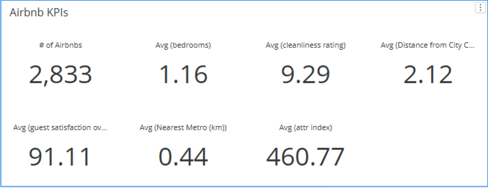

These aggregates provide an immediate quality baseline for the entire city.

## 8. Advanced Interactivity and Visual Polish

Interactivity transforms a report into a discovery tool. By linking visualizations, we allow users to isolate specific segments of the market.

### Configuring Target Interactivity

Ensure you are in **Edit Mode**. On the Bar Chart, click the hamburger menu and select **Select Target Visualization**. Choose the Map, KPIs, and the Ring Chart as targets and click **Apply**. Now, clicking the "Entire Home" bar will dynamically update the Map and Ring Chart to show only the data relevant to that segment.

### Final Branding and Sharing

Enhance the visual appeal by clicking the **Image** icon and adding an external image via **URL** (e.g., a skyline of Barcelona) to brand the Dossier. An image  `barcelona.jpg` is provided for you.

### Conclusion

Save your Dossier as an **.mstr** file. This file format is the universal container for MicroStrategy insights; it can be emailed to colleagues or uploaded directly to an enterprise environment for widespread distribution. You have successfully moved from a raw spreadsheet to a professional, interactive analytical asset. Whether used for travel planning or investment analysis, you now have the tools to make data-driven decisions in the Barcelona market.