# Lab 4: Building an Internal Audit Exception Dashboard in MicroStrategy

## 1. Introduction and Lab Objectives

In the previous labs, you learned to import data, build visualizations, link multiple datasets, and apply formatting to highlight key insights. In this lab, you will apply those skills to a real-world **internal audit** context by building a multi-chapter Dossier that identifies procurement red flags, HR/payroll anomalies, and payment exceptions.

This lab introduces several new concepts:

- **Multi-chapter Dossier design** — organizing related analyses into separate chapters within a single Dossier
- **Conditional formatting on Grids** — color-coding rows based on exception criteria
- **Text visualizations** — adding context and descriptions to dashboard pages
- **Visualization-level filters** — isolating specific exception records within a visualization
- **Derived attributes** — creating bucketed categories from numeric fields

By the end of this lab, you will have a 3-chapter audit dashboard covering procurement, HR/payroll, and payment exceptions — the kind of tool internal audit teams use to monitor organizational risk.

## 2. Understanding the Datasets

This lab uses four CSV files representing audit-relevant data from a fictional organization.

| File | Rows | Description | Key Fields |
|------|------|-------------|------------|
| `procurement_audit.csv` | 75 | Purchase requests with approval and vendor details | `PR_ID`, `PR_Creator`, `PR_Approver`, `Vendor_Name`, `PR_Amount_USD`, `Bidding_Type`, `Approval_Days` |
| `hr_employees.csv` | 50 | Employee master data with status and bank details | `Employee_ID`, `Full_Name`, `Department`, `Status`, `Resignation_Date`, `Is_Ghost_Employee` |
| `hr_payroll.csv` | 200 | Monthly payroll records (50 employees x 4 months) | `Employee_ID`, `Gross_Pay`, `Net_Pay`, `Pay_Change_Pct`, `Is_Weekend`, `Is_Unusual_Change` |
| `payment_transactions.csv` | 80 | Invoice payments with exception flags | `Payment_ID`, `Vendor_Name`, `PO_Amount`, `Payment_Amount`, `Days_Overdue`, `Aging_Bucket` |

Each dataset has **embedded red flags** — anomalous records that an internal auditor would want to investigate. Your dashboard will surface these exceptions through KPIs, grids, and charts.

---

## 3. Chapter 1: Procurement Audit

### Why This Matters

Procurement is one of the highest-risk areas for fraud and policy violations in any organization. When internal controls are weak, employees can exploit the purchasing process by approving their own requests, steering contracts to preferred vendors, or letting purchase orders remain open indefinitely without accountability.

This dashboard helps the audit team answer four critical questions:

1. **Segregation of duties — are we enforcing it?** A fundamental internal control is that the person requesting a purchase should never be the same person approving it. When this control fails, it creates an opportunity for unauthorized spending. Our data flags 10 cases where the creator and approver are the same individual — each one warrants investigation.

2. **Are we getting competitive prices?** Single-source procurement bypasses competitive bidding, which means the organization may be overpaying or favoring specific vendors without justification. We expect to see ~8 single-source requests in this data, concentrated among certain vendors and expense categories.

3. **Is the approval process timely?** Delayed approvals can indicate bottlenecks, understaffing, or deliberate stalling. When approvals exceed the standard maximum for a given expense category, it disrupts operations and may signal process breakdowns.

4. **Are purchase orders being closed on time?** Long-open POs tie up committed funds and may indicate that goods or services were never received, or that someone is keeping a PO open to route future unauthorized spending through it.

**How to use this dashboard going forward:** This is the type of dashboard an audit team should review **monthly**. The KPIs at the top give you an instant health check — if the flagged PR count or single-source percentage is climbing, it signals deteriorating controls. The detail grid lets you drill into specific transactions for follow-up. Over time, tracking these metrics helps you measure whether corrective actions (training, policy changes, system enforcements) are actually reducing exceptions.

### Importing `procurement_audit.csv`

1. Create a **New Dossier** in MicroStrategy. In the Dataset panel, click **New Data** and select **File from Disk**.

2. Choose the `procurement_audit.csv` file and click **Prepare Data** (not Finish).


### Classifying Attributes and Metrics

3. In the Data Editor, verify that MicroStrategy has correctly classified your columns. You will need to make the following adjustments:

   - **Convert to Metric** (right-click > Convert to Metric):
     - `PR_Amount_USD`
     - `Approval_Days`
     - `Standard_Max_Days`
     - `PO_Open_Days`

   - **Verify as Attribute** (these should already be attributes):
     - `PR_ID`, `PR_Date`, `PR_Creator`, `PR_Approver`
     - `Vendor_Name`, `Vendor_City`
     - `Expense_Category`, `Bidding_Type`, `PO_Status`
     - `Is_Same_Creator_Approver`

4. Click **Finish** to complete the import.

### Renaming the Chapter

5. At the bottom of the Dossier, you will see a tab labeled **Page 1**. Double-click the tab name and rename it to **Procurement Audit**.


### Adding a Text Visualization

6. From the visualization gallery, add a **Text** visualization at the top of the page. Type the following description:

   > **Procurement Audit Dashboard** 
   >
   > This chapter highlights procurement exceptions including same creator/approver violations, single-source bidding concentration, and delayed approval patterns.

   Format the text with bold for the title. This provides context for anyone viewing the dashboard.
   
   

### KPI 1: Total PRs

7. Add a **KPI** visualization. Drag `Row Count - procurement_audit.csv` into it. Rename this metric to `Total PRs`.


### KPI 2: Flagged PRs (Same Creator/Approver)

8. We need to create a derived metric that counts only the PRs where the creator and approver are the same person. Open the **Formula Editor** (click the **+** next to Metrics) and create a new metric with the formula:

   ```
   Sum(IF(([Is Same Creator Approver]@ID="Y"), 1, 0)){~+}
   ```

   Name this metric `Flagged PR Count`. Validate and save.

   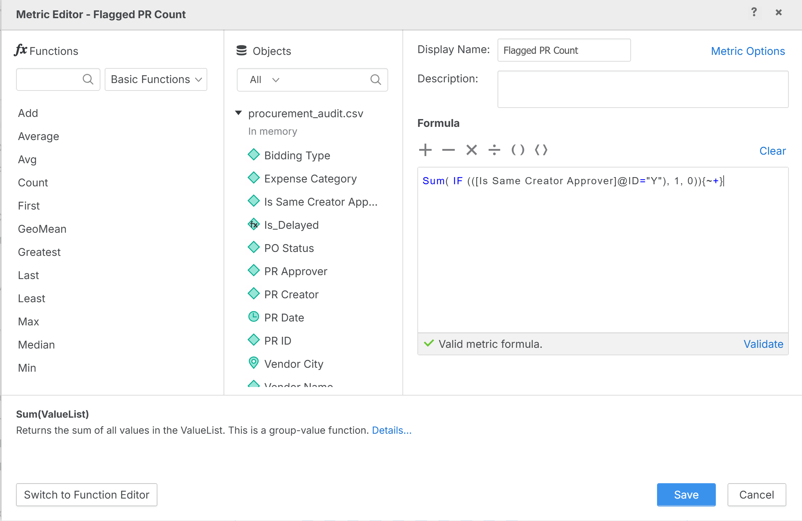

   

9. Add a second **KPI** visualization and drag `Flagged PR Count` into it.


### KPI 3: Single-Source Bidding Percentage

10. Create another derived metric. In the Formula Editor, enter:

    ```
    Sum( IF (([Bidding Type]@ID="Single_Source"), 1, 0)){~+}/Count([PR ID]){~+}
    ```

    Name this metric `Single Source Pct`. Validate and save.

    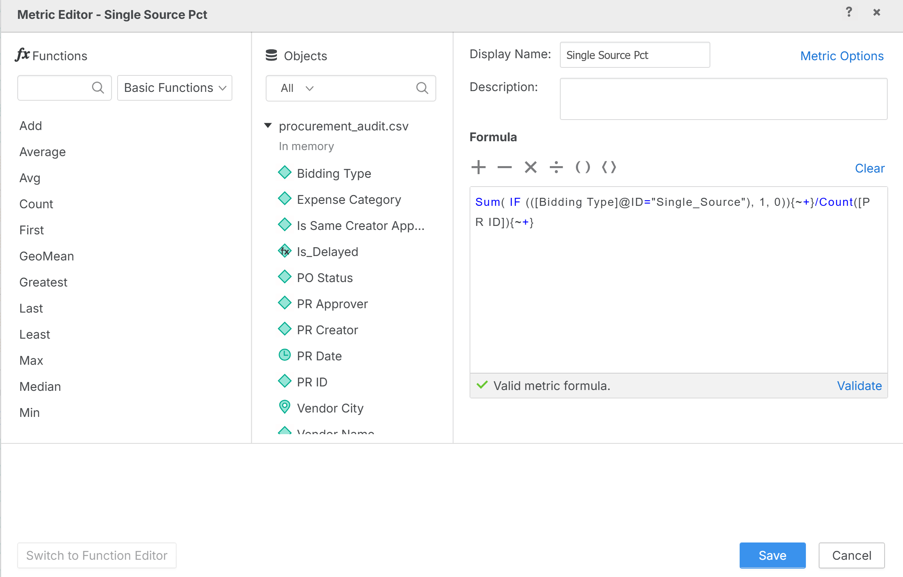

11. Add a third **KPI** visualization and drag `Single Source Pct` into it. Format the number to show one decimal place and add a `%` suffix if desired.

    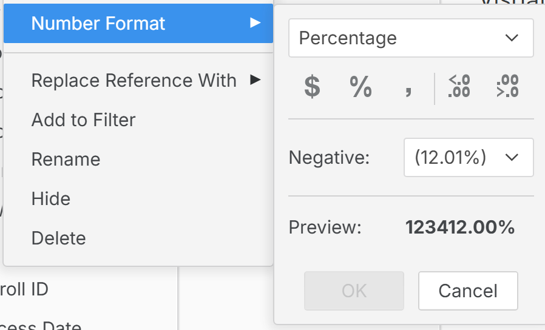

12. Arrange the three KPI cards in a row at the top of the page (below the text visualization).

    

### Grid: All Purchase Requests

13. Add a **Grid** visualization below the KPI cards. Drag the following fields into the grid:
    - `PR_ID`
    - `PR_Date`
    - `PR_Creator`
    - `PR_Approver`
    - `Vendor_Name`
    - `PR_Amount_USD`
    - `Bidding_Type`
    - `Approval_Days`
    - `Is_Same_Creator_Approver`

14. Name this visualization `Purchase Request Details`.


### Conditional Formatting: Same Creator/Approver (Red)

15. Select the Grid visualization. In the Format panel (right side), navigate to **Conditional Formatting** (or right-click a cell and select **Conditional Formatting**).

16. Click **Add a Rule**. Configure the rule as follows:

    1. Right Click the column in the Grid and select **Thresholds**

    2.  Click __New Threshold__ then create the following

       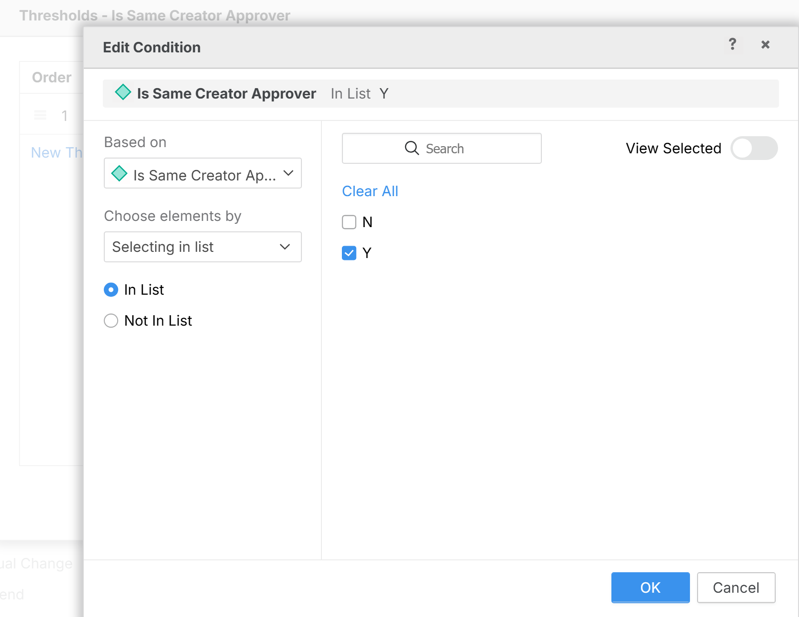

    3. **Based on:** `Is_Same_Creator_Approver`

    4. **Condition:** Equals `Y`

    5. Click Ok

    6. Then click on the three dots, and select __Formatting__

       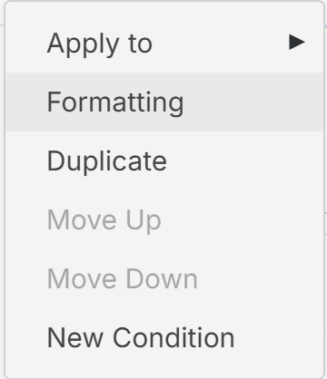

    7. **Formatting:** Set the **background color** to **Red** and the **font color** to **White**

    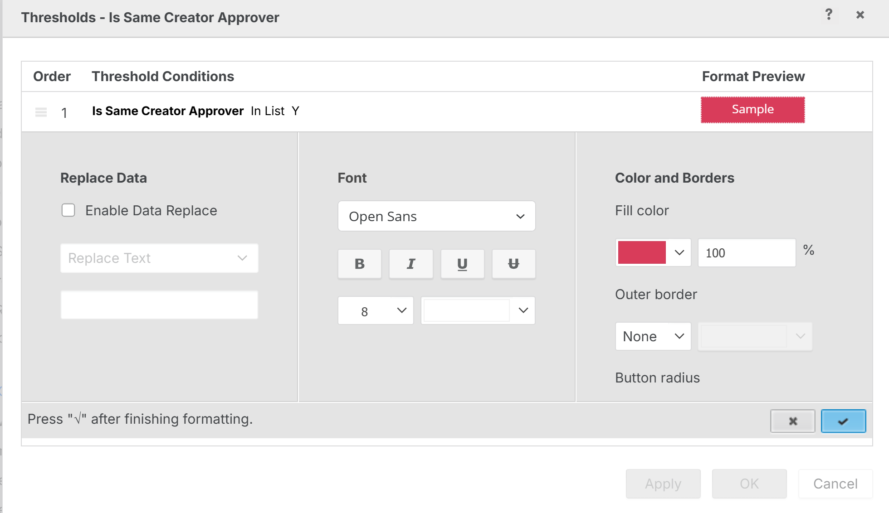

    Then click the __plus sign__

17. Click **Apply**. Rows where the creator and approver are the same person will now be highlighted in red.

    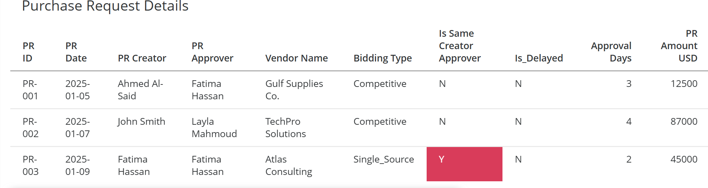

### Conditional Formatting: Delayed Approvals (Orange)

18. Add a second conditional formatting rule:
    
    1.  Create a derived **attribute** `IF(([Approval Days]>[Standard Max Days]), "Y", "N")`  and name it `Is_Delayed`
    
       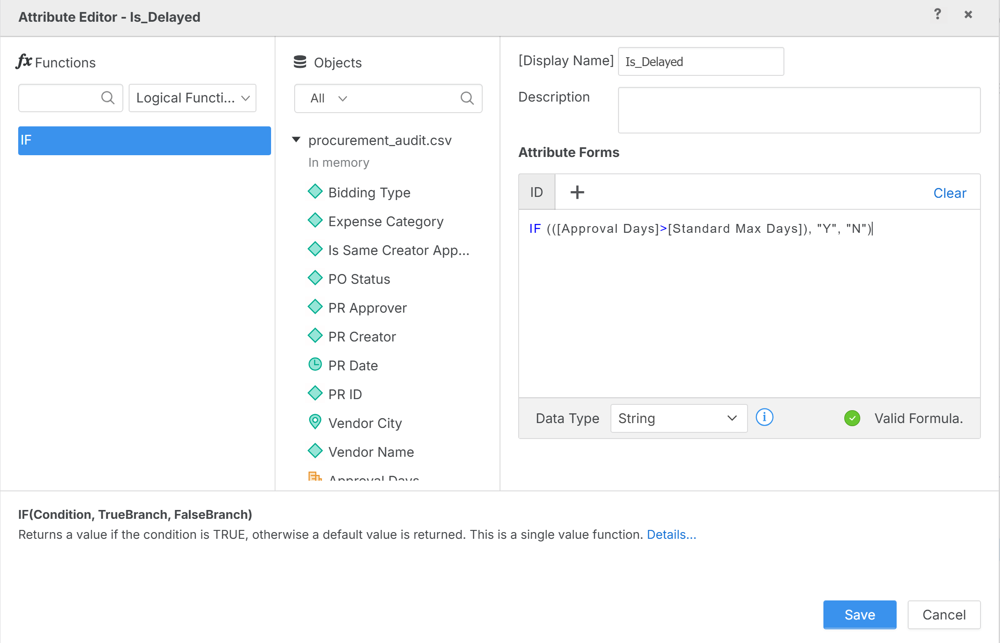
    
    2. Now, create the condition formatting based on `Is_Delayed`
    
       1. **Condition:** Equals `Y`
    
          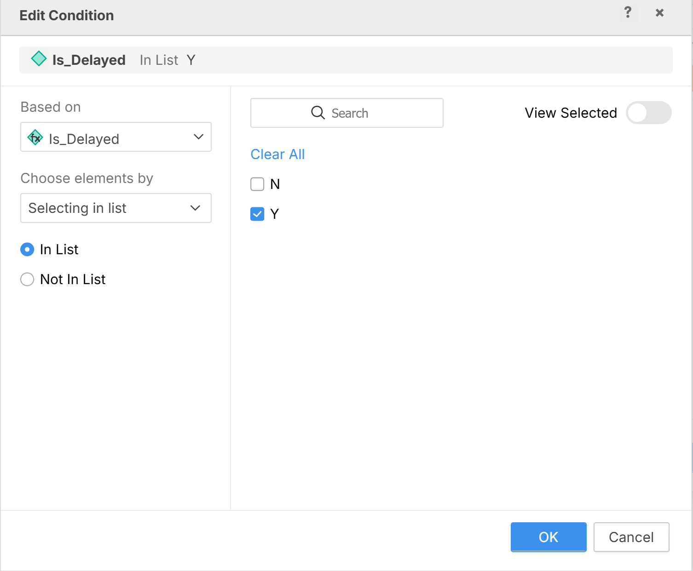
    
       2. **Formatting:** Set the **background color** to **Orange**
    
    
    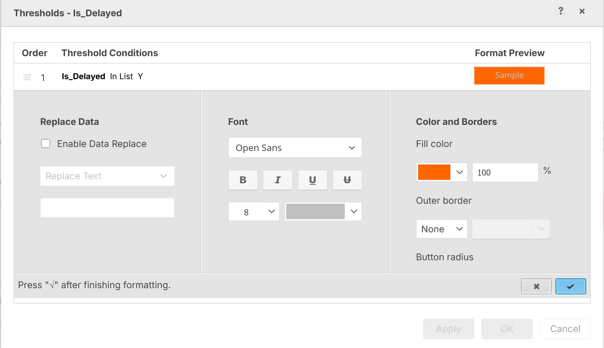
    
    Click the __plus sign__ then __OK__
    
    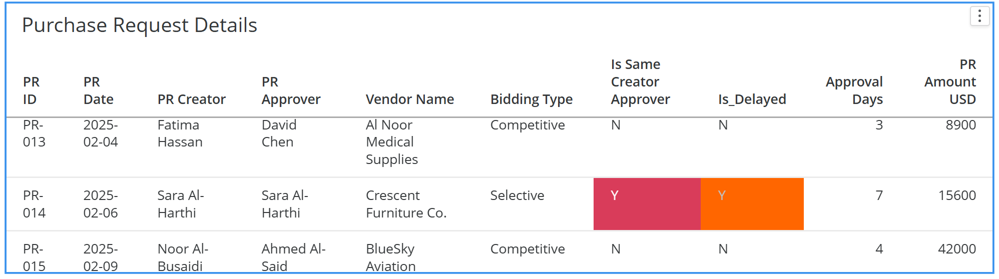

### Horizontal Bar Chart: PR Count by Bidding Type

19. Add a **Horizontal Bar Chart** visualization. Drag `Bidding Type` to the vertical axis and `Total PRs` (Row Count) to the horizontal axis.

20. Name this visualization `PR Count by Bidding Type`. This chart clearly shows the concentration of single-source vs. competitive bidding.


### Bar Chart: Top Vendors by Amount

21. Add a **Bar Chart** visualization. Drag `Vendor_Name` to the horizontal axis and `PR_Amount_USD` to the vertical axis.

22. Sort descending by `PR_Amount_USD` to see which vendors receive the most procurement spend. Name this visualization `Top Vendors by PR Amount`.

23. Your completed Procurement Audit chapter should look similar to the layout below — KPIs at top, grid in the middle, and two charts at the bottom. Try to match font style, and overall look and feel as a challenge

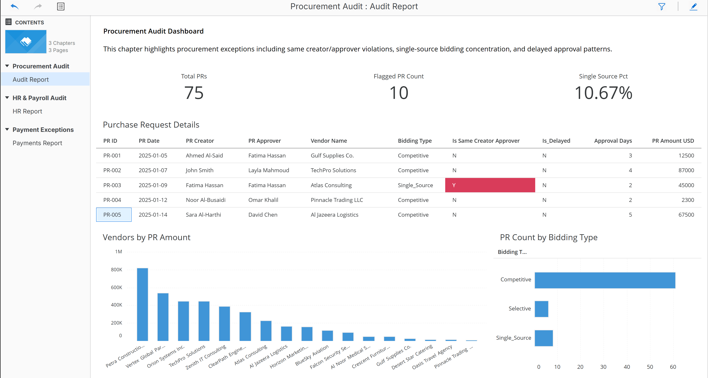

---

## 4. Chapter 2: HR & Payroll Audit

### Why This Matters

Payroll is often the largest recurring expense in an organization, and it is a prime target for fraud. Unlike procurement fraud — which requires vendors and invoices — payroll fraud can be carried out entirely from the inside, making it harder to detect without analytics.

This dashboard targets three specific risks:

1. **Ghost employees — who is getting paid that shouldn't be?** A ghost employee is someone who appears as "Active" in the HR system but has actually resigned or left the organization. Their salary continues to be processed, and someone — often the person who should have deactivated them — is collecting the payments. Our data contains 5 ghost employees: individuals with Active status whose resignation dates are months in the past. In a real organization, each of these would trigger an immediate investigation into where the payroll funds are going.

2. **Weekend and holiday payroll processing — why is someone running payroll off-cycle?** Payroll is typically processed on business days through an automated system. When payroll transactions appear on weekends, it often means someone manually processed them outside normal controls — potentially to add unauthorized payments, inflate hours, or push through changes before they can be reviewed. Our data flags 8 weekend-processed records across different employees and months.

3. **Unusual pay changes — did someone give themselves a raise?** Month-over-month pay should be relatively stable for salaried employees. A sudden spike (or drop followed by a spike) of more than 20% could indicate unauthorized salary changes, overtime manipulation, or data entry errors that need investigation. Our data contains 6 employees with pay fluctuations exceeding 20% between consecutive months.

**How to use this dashboard going forward:** This dashboard should be run **monthly**, ideally within the first week after payroll closes. The ghost employee grid should be checked every cycle — in a well-controlled environment, this list should always be empty. The weekend processing count is a leading indicator: if it starts increasing, it may signal that manual overrides are becoming normalized. The pay trend chart by department helps auditors spot anomalies visually — a sudden spike in one department's average pay is worth investigating even if no individual exceeds the 20% threshold.

### Adding a New Chapter

1. At the bottom of the Dossier, click the **+** icon (or right-click the existing chapter tab) to add a new chapter. Name it **HR & Payroll Audit**.


### Importing `hr_employees.csv`

2. In the Dataset panel, click **New Data** and import the `hr_employees.csv` file. Click **Prepare Data**.

3. In the Data Editor, verify the column classifications. All columns should remain as attributes — no metrics are needed from this dataset. Click **Finish**.


### Importing `hr_payroll.csv`

4. Click **New Data** again and import `hr_payroll.csv`. Click **Prepare Data**.

5. Convert the following columns to **Metrics** (right-click > Convert to Metric):
   - `Gross_Pay`
   - `Deductions`
   - `Net_Pay`
   - `Previous_Gross_Pay`
   - `Pay_Change_Pct`

6. Verify that `Is_Weekend` and `Is_Unusual_Change` remain as **Attributes**. Click **Finish**.


### Linking Datasets by Employee_ID

7. In the Dataset panel, right-click `Employee_ID` (under `hr_employees.csv`) and select **Link to Other Dataset...**

8. Link it to `Employee_ID` in `hr_payroll.csv`. Click **Show Attribute Forms** to verify the mapping shows `Employee_ID (ID)` linked to `Employee_ID (ID)`. Click **OK**.

   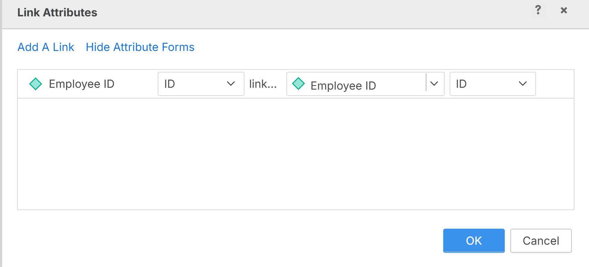

9. You should now see link icons next to the `Employee_ID` fields in both datasets, confirming the datasets are connected.


### KPI 1: Total Active Employees

10. Create a derived metric with the formula:

    ```
    Sum(IF((Status@ID="Active"), 1, 0))
    ```

    Name it `Active Employee Count`. Add it as a **KPI** visualization.

    

### KPI 2: Ghost Employee Count

11. Create a derived metric:

    ```
    Sum(IF(([Is Ghost Employee]@ID="Y"), 1, 0))
    ```

    Name it `Ghost Employee Count`. Add it as a **KPI** visualization.

    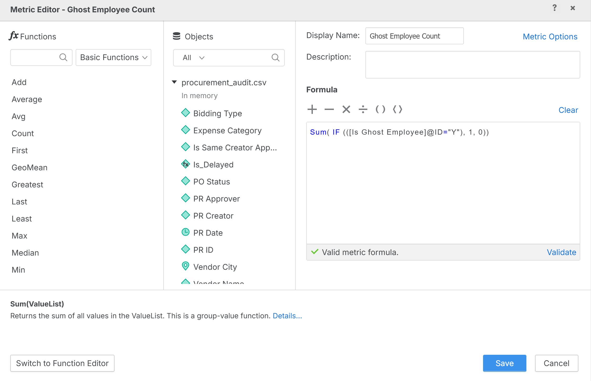

### KPI 3: Weekend Payroll Count

12. Create a derived metric in `hr_payroll.csv`:

    ```
    Sum(IF(([Is Weekend]@ID="Y"), 1, 0))
    ```

    Name it `Weekend Payroll Count`. Add it as a **KPI** visualization.

    

13. Arrange the three KPIs in a row at the top of the chapter.

    

### Grid: Ghost Employees

14. Add a **Grid** visualization. Drag the following fields from `hr_employees.csv`:
    - `Employee_ID`
    - `Full_Name`
    - `Department`
    - `Branch_Location`
    - `Status`
    - `Resignation_Date`
    - `Is_Ghost_Employee`

15. Name this visualization `Ghost Employees`.

    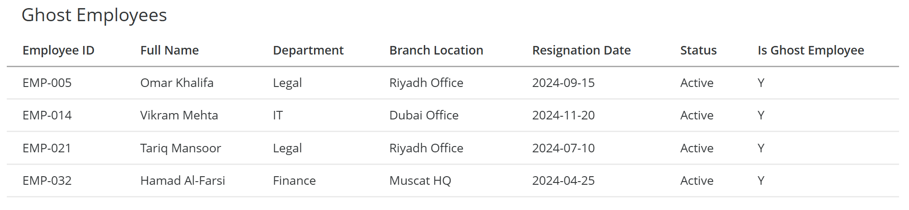

### Applying a Visualization-Level Filter

16. We only want to show ghost employees in this grid. Click on the Grid, then in the **Filter** panel, drag `Is_Ghost_Employee` into the filter area.

17. Set the filter to show only records where `Is_Ghost_Employee = Y`.

    

18. The grid should now display only the 5 ghost employees — staff with Active status but a resignation date in the past.

    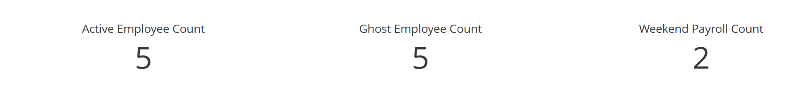

### Grid: Unusual Payroll Records

19. Add another **Grid** visualization with the following fields from `hr_payroll.csv`:
    - `Payroll_ID`
    - `Employee_ID`
    - `Employee_Name`
    - `Department`
    - `Pay_Month`
    - `Process_Date`
    - `Day_of_Week`
    - `Gross_Pay`
    - `Pay_Change_Pct`
    - `Is_Weekend`
    - `Is_Unusual_Change`

20. Name this visualization `Unusual Payroll Records`.

21. Apply a **visualization-level filter** to show only records where `Is_Weekend = Y` **OR** `Is_Unusual_Change = Y`. Click the three dots on the top right corner and select **Edit Filter**

    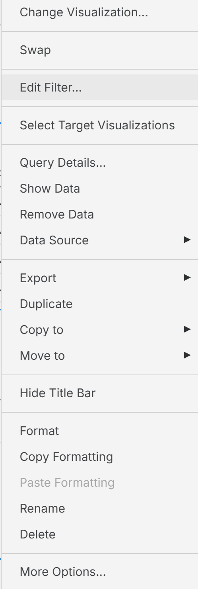

    Then click __Add New Qualification__

    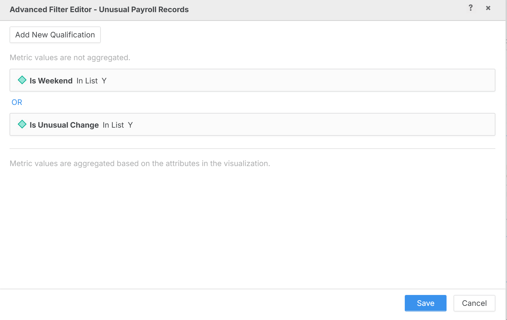

### Conditional Formatting on Unusual Payroll Grid

22. Add conditional formatting rules to this grid:
    - **Rule 1:** Where `Is_Weekend = Y` → Background color **Red**, font color **White**
    - **Rule 2:** Where `Is_Unusual_Change = Y` → Background color **Orange**

    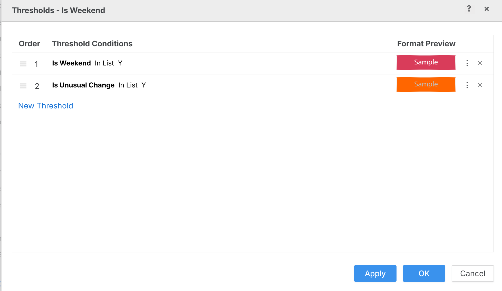

### Line Chart: Average Gross Pay Trend

23. Add a **Line Chart** visualization. Drag `Pay_Month` to the horizontal axis and `Gross_Pay` to the vertical axis.

24. Change the aggregation of `Gross_Pay` to **Average** (right-click the metric > **Aggregation** > **Average**).

25. Drag `Department` to the **Break By** zone to create separate lines for each department.

26. Name this visualization `Average Gross Pay by Month`.

27. Your completed HR & Payroll Audit chapter should include KPIs at top, the two filtered grids in the middle, and the trend line chart at the bottom:


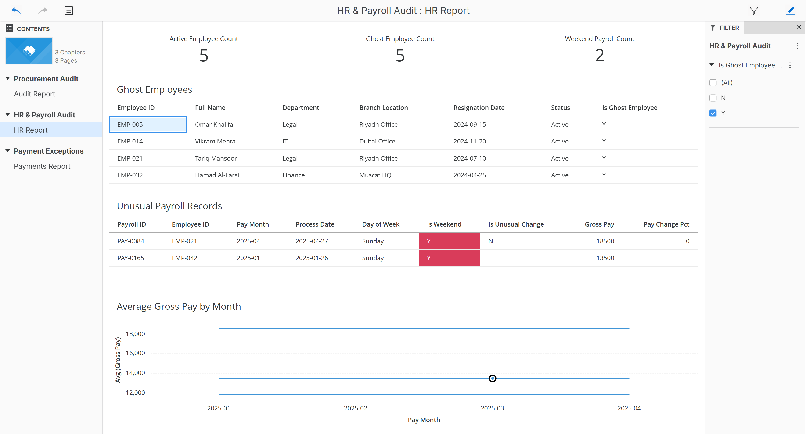

---

## 5. Chapter 3: Payment Exceptions

### Why This Matters

The payments process is where money actually leaves the organization, making it the last line of defense against financial loss. Even with strong procurement controls upstream, errors and fraud can still occur at the payment stage — duplicate invoices get paid twice, vendors overcharge beyond the agreed purchase order amount, and invoices sit unpaid well past their due dates, damaging vendor relationships and incurring penalties.

This dashboard monitors three categories of payment exceptions:

1. **Duplicate payments — are we paying the same invoice twice?** This is one of the most common findings in payment audits. It happens when the same invoice is entered into the system more than once — sometimes by different clerks, sometimes through system errors, and occasionally intentionally. Our data contains 3 pairs of duplicate payments (6 flagged records) where the same invoice number, vendor, and amount appear in two separate payment transactions. In practice, recovering duplicate payments requires prompt detection — the longer they go unnoticed, the harder they are to claw back.

2. **Overpayments — are we paying more than we agreed to?** When the payment amount exceeds the original purchase order amount, it raises questions. Sometimes there is a legitimate reason (price adjustments, shipping costs), but often it indicates invoice inflation, unauthorized scope changes, or collusion between an employee and a vendor. Our data flags 5 overpayments where the payment exceeds the PO amount by approximately 15%.

3. **Overdue payments — what is our aging exposure?** Overdue invoices represent both a compliance risk and a financial risk. They can lead to late payment penalties, strained vendor relationships, and supply chain disruptions. More importantly, a pattern of aging receivables can indicate cash flow problems or breakdowns in the accounts payable process. Our data includes 12 overdue payments distributed across aging buckets: 5 in the 31-60 day range, 4 in the 61-90 day range, and 3 that are over 90 days past due — the most critical category.

**How to use this dashboard going forward:** This is a dashboard that the accounts payable team and the audit team should review **weekly**. The duplicate payment KPI is a zero-tolerance metric — any value above zero requires immediate follow-up. The overpayment count should be investigated case by case, with each instance either justified through documentation or flagged for recovery. The overdue amount by vendor chart helps prioritize collection efforts: focus on the vendors with the largest overdue balances first. Over time, tracking the aging distribution chart reveals whether the organization's payment discipline is improving or deteriorating — a shrinking "Over 90 Days" bar is a sign of healthier controls.

### Adding a New Chapter

1. Click the **+** icon at the bottom of the Dossier to add a third chapter. Name it **Payment Exceptions**.


### Importing `payment_transactions.csv`

2. Click **New Data** and import `payment_transactions.csv`. Click **Prepare Data**.

3. Convert the following columns to **Metrics**:
   - `PO_Amount`
   - `Payment_Amount`
   - `Days_Overdue`

4. Verify that `Aging_Bucket`, `Is_Duplicate`, `Is_Overpayment`, and `Is_Overdue` remain as **Attributes**. Click **Finish**.

   

### KPI 1: Total Payments

5. Add a **KPI** visualization using `Row Count - payment_transactions.csv`. Rename the metric to `Total Payments`.

   

### KPI 2: Duplicate Payment Count

6. Create a derived metric:

   ```
   Sum(If(Is_Duplicate = "Y", 1, 0))
   ```

   Name it `Duplicate Payment Count`. Add it as a KPI.


### KPI 3: Overpayment Count

7. Create a derived metric:

   ```
   Sum(If(Is_Overpayment = "Y", 1, 0))
   ```

   Name it `Overpayment Count`. Add it as a KPI.


### KPI 4: Total Overdue Amount

8. Create a derived metric:

   ```
   Sum(If(Is_Overdue = "Y", Payment_Amount, 0))
   ```

   Name it `Total Overdue Amount`. Add it as a KPI. Format as currency.

   

9. Arrange the four KPIs in a row at the top.

   

### Grid: Payment Exception Details

10. Add a **Grid** visualization with the following fields:
    - `Payment_ID`
    - `Invoice_ID`
    - `Vendor_Name`
    - `Payment_Date`
    - `PO_Amount`
    - `Payment_Amount`
    - `Days_Overdue`
    - `Aging_Bucket`
    - `Is_Duplicate`
    - `Is_Overpayment`
    - `Is_Overdue`

11. Name this visualization `Payment Exception Details`.

12. Apply a **visualization-level filter** to show only flagged records: `Is_Duplicate = Y` OR `Is_Overpayment = Y` OR `Is_Overdue = Y`.

    > **Tip:** Similar to Chapter 2, you may create a derived attribute: `Has_Any_Flag = If(Is_Duplicate = "Y" OR Is_Overpayment = "Y" OR Is_Overdue = "Y", "Y", "N")` and filter on `Has_Any_Flag = Y`.

    

### Conditional Formatting: Aging Buckets

13. Apply conditional formatting to the grid based on the `Aging_Bucket` attribute:
    - **31-60 Days** → Background color **Yellow**
    - **61-90 Days** → Background color **Orange**
    - **Over 90 Days** → Background color **Red**, font color **White**

    

14. The grid should now visually highlight the severity of overdue payments using a color gradient from yellow to red.

    

### Derived Attribute: Aging Bucket (Alternative Method)

15. If you want to practice creating a **derived attribute** from a numeric field, you can recreate the aging bucket classification. In the Formula Editor, create a new attribute:

    ```
    If(Days_Overdue = 0, "Current",
       If(Days_Overdue <= 30, "1-30 Days",
          If(Days_Overdue <= 60, "31-60 Days",
             If(Days_Overdue <= 90, "61-90 Days", "Over 90 Days"))))
    ```

    Name it `Aging Category`. This is a **derived attribute** — a new categorical field computed from a numeric metric. This technique is useful when your source data does not already include a bucketed field.

    

### Horizontal Bar Chart: Overdue Amount by Vendor

16. Add a **Horizontal Bar Chart**. Drag `Vendor_Name` to the vertical axis and `Payment_Amount` to the horizontal axis.

17. Apply a **visualization-level filter** to show only records where `Is_Overdue = Y`.

18. Sort descending by `Payment_Amount`. Name this visualization `Overdue Amount by Vendor`.

    

### Bar Chart: Payment Count by Aging Bucket

19. Add a **Bar Chart**. Drag `Aging_Bucket` to the horizontal axis and `Total Payments` (Row Count) to the vertical axis.

20. Name this visualization `Payment Count by Aging Bucket`. This shows the distribution of payments across aging categories.

    

21. Your completed Payment Exceptions chapter should include 4 KPIs at top, the filtered and color-coded grid in the middle, and two charts at the bottom:

    

---

## 6. Final Review and Save

### Reviewing All Three Chapters

1. Navigate through your three chapters by clicking the tabs at the bottom of the Dossier:
   - **Procurement Audit** — KPIs, PR detail grid with conditional formatting, bidding type chart, vendor concentration chart
   - **HR & Payroll Audit** — KPIs, ghost employee grid, unusual payroll grid, pay trend line chart
   - **Payment Exceptions** — KPIs, payment exception grid with aging colors, overdue vendor chart, aging distribution chart

2. Verify that conditional formatting is applied correctly in each chapter:
   - Chapter 1: Red rows for same creator/approver, orange for delayed approvals
   - Chapter 2: Red rows for weekend processing, orange for unusual pay changes
   - Chapter 3: Yellow/orange/red for aging buckets

3. Save the Dossier with a meaningful name such as `Internal Audit Exception Dashboard`.

   

### Conclusion

In this lab, you built a comprehensive 3-chapter Internal Audit Exception Dashboard. You learned to:

- **Design multi-chapter Dossiers** to organize related analyses into logical sections
- **Apply conditional formatting** to Grid visualizations to highlight exception records with color-coded severity
- **Use text visualizations** to provide context and descriptions for dashboard users
- **Create visualization-level filters** to isolate specific subsets of data within individual visualizations
- **Build derived metrics and attributes** including conditional counts, percentages, and bucketed categories

These techniques are directly applicable to real-world audit analytics, where dashboards must surface exceptions, quantify risk, and enable drill-down investigation.

---

## Summary of New Concepts

| Concept | Where Used | Description |
|---------|-----------|-------------|
| Multi-chapter Dossier | All 3 chapters | Organizing related analyses into separate named chapters |
| Conditional formatting on Grids | Ch 1, 2, 3 | Color-coding rows based on attribute or metric values |
| Text visualization | Ch 1 | Adding descriptive context to a dashboard page |
| Visualization-level filters | Ch 2, 3 | Filtering data within a single visualization (not globally) |
| Derived attributes (bucketing) | Ch 3 | Creating categorical fields from numeric ranges |
| Conditional derived metrics | Ch 1, 2, 3 | Using `If()` to count or sum only matching records |
